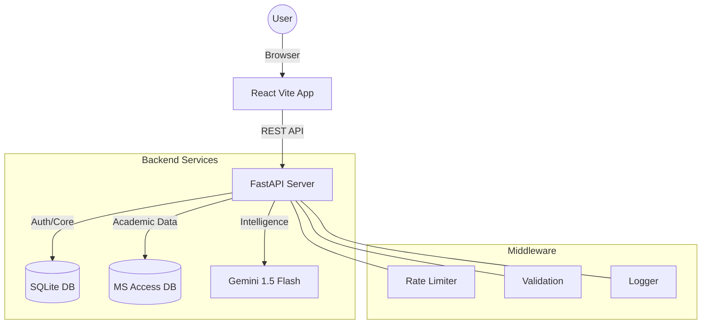

# EduSphere — Universal University LMS System


**EduSphere LMS** is an enterprise-grade academic management platform designed for modern universities. It features a high-performance React frontend with an "iOS 26 Liquid Glass" design language and a robust FastAPI backend with a hybrid SQLite + MS Access database architecture.

## 🚀 Key Features

-   **Intelligence Hub**: Role-based dashboards (Student, Faculty, Admin) with live KPI metrics and predictive analytics.
-   **Hybrid Database**: Seamless integration with institutional MS Access databases for real-time academic data, with automatic SQLite fallback.
-   **AI Assistant**: Context-aware institutional AI powered by Gemini 3 Flash to assist with scheduling, grading, and campus life.
-   **Module Suite**: 11+ functional modules including Attendance, Curriculum, Finance, Exams, Placements, and Digital Library.
-   **Security First**: Built-in rate limiting, input sanitization, JWT authentication with rotation, and structured audit logging.
-   **High Performance**: React code-splitting, lazy loading, and paginated API endpoints for sub-second response times.

## 🛠️ Technology Stack

-   **Frontend**: React 19, TypeScript, Vite, Tailwind CSS, Lucide React, Recharts.
-   **Backend**: FastAPI, SQLAlchemy, Pydantic, PyODBC (for MS Access).
-   **Database**: SQLite (Core/Auth) + MS Access (Academic Data).

## 📥 Getting Started

### Prerequisites
-   **Node.js** (v18+)
-   **Python** (v3.10+)
-   **MS Access ODBC Driver** (64-bit)

### Installation

1.  **Clone the repository**
    ```bash
    git clone https://github.com/subashkarthik/EduSphere_LMS.git
    cd EduSphere_LMS
    ```

2.  **Setup Backend**
    ```bash
    cd server
    python -m venv venv
    source venv/bin/activate  # or venv\Scripts\activate on Windows
    pip install -r requirements.txt
    python -m utils.seed  # Seed the initial database
    ```

3.  **Setup Frontend**
    ```bash
    cd ..
    npm install
    ```

### Running the Application

1.  **Start Backend** (Port 5000)
    ```bash
    npm run dev:backend
    ```

2.  **Start Frontend** (Port 3000)
    ```bash
    npm run dev
    ```

## 🔐 Credentials (Demo Mode)

| Role | Email | Password |
| :--- | :--- | :--- |
| 🎓 **Student** | `alex.j@edusphere.edu.in` | `student123` |
| 👨‍🏫 **Faculty** | `arun.kumar@edusphere.edu.in` | `faculty123` |
| 🔑 **Admin** | `admin@edusphere.edu.in` | `admin123` |

## 📐 Architecture



## 📜 License
This project is licensed under the MIT License - see the [LICENSE](LICENSE) file for details.
